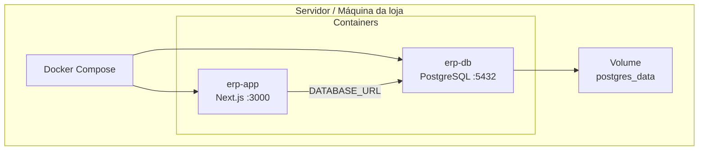
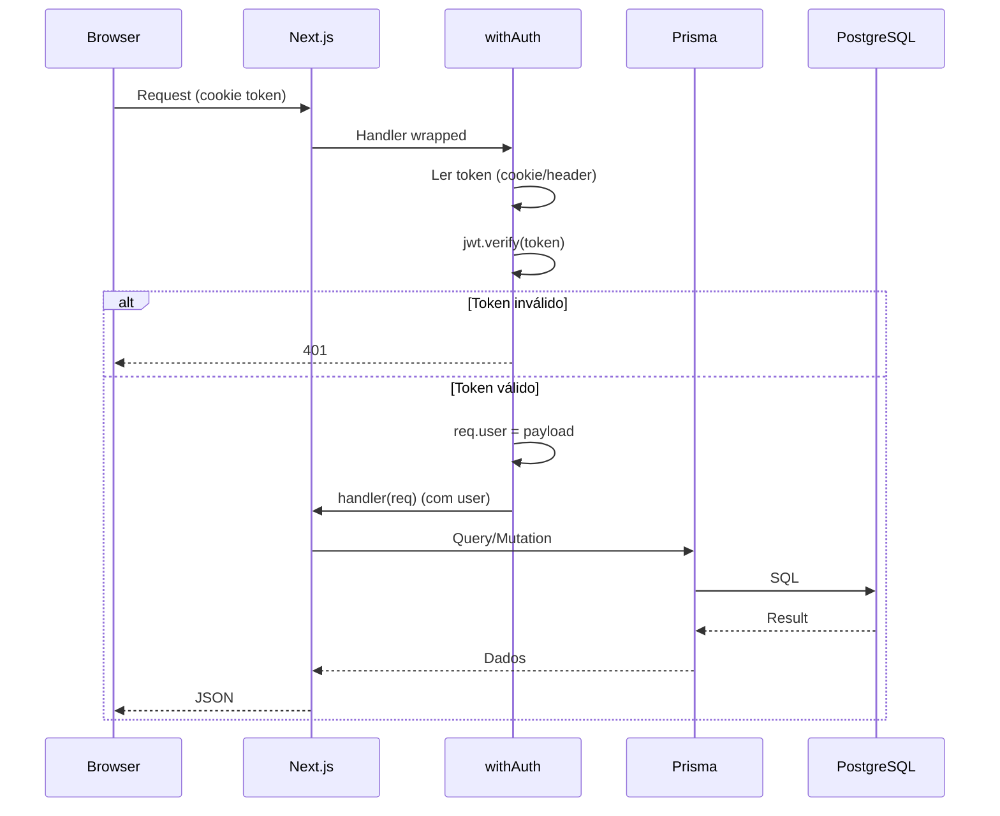

# Arquitetura do ERP Espaço Mulher

Este documento descreve a arquitetura técnica, a stack de deploy, o controle de usuários e as decisões de implementação do sistema. O ERP está **em uso em ambiente de loja**, com deploy via **Docker**.

---

## 1. Visão geral

O ERP é uma aplicação **full-stack monolítica** em Next.js 14 (App Router):

- **Frontend:** React 18, TypeScript, Tailwind CSS, componentes server e client.
- **Backend:** API Routes no mesmo processo (REST), lógica nas rotas e em `lib/`.
- **Banco:** PostgreSQL 16, acesso via Prisma ORM.
- **Autenticação:** JWT (cookie httpOnly + fallback em header/sessionStorage para cenários como rede local/Docker).
- **Deploy:** Docker (imagem da app) + Docker Compose (app + PostgreSQL), com dados persistidos em volume.

---

## 2. Stack de produção (Docker)

### 2.1 Serviços

| Serviço | Container | Imagem / Build | Porta host → container | Observação |
|---------|-----------|----------------|------------------------|------------|
| **Aplicação** | erp-app | Build do Dockerfile (Node + Next.js) | 3001 → 3000 | Next.js em modo production, reinício automático. |
| **Banco de dados** | erp-db | postgres:16-alpine | 5433 → 5432 | Volume `erp_postgres_data`, healthcheck, TZ e locale PT-BR. |

### 2.2 Fluxo de deploy

- O Compose sobe primeiro o `db`; o healthcheck garante que o PostgreSQL está pronto antes do `app` iniciar.
- O `app` usa `DATABASE_URL` apontando para o serviço `db` na rede interna do Compose.
- Dados do banco ficam no volume nomeado `erp_postgres_data`, persistindo entre reinícios.

### 2.3 Variáveis de ambiente (app)

- **DATABASE_URL** — Conexão ao PostgreSQL (no compose: `postgresql://erp:...@db:5432/erp_espaco_mulher`).
- **JWT_SECRET** — Chave para assinatura do JWT (obrigatória em produção).
- **ADMIN_EMAIL** / **ADMIN_PASSWORD** — Usados na criação inicial do usuário administrador (script de init).
- **NODE_ENV** — `production` no compose.
- **HOSTNAME** / **PORT** — Bind da aplicação (ex.: 0.0.0.0:3000).

---

## 3. Fluxo de requisição

---

## 4. Controle de usuários e permissões

### 4.1 Perfis (roles)

| Role | Nível numérico | Uso |
|------|----------------|-----|
| **CAIXA** | 1 | Operação de PDV, consulta de produtos/clientes/fornecedores, dashboard. |
| **GERENTE** | 2 | Tudo do Caixa + financeiro, contas a pagar/receber, despesas fixas, relatórios, vendas (histórico e cancelamento), listar/criar usuários. |
| **ADMIN** | 3 | Acesso total: categorias, CRUD completo de produtos e usuários, configurações restritas. |

A hierarquia é usada no backend (ex.: `user.role === 'ADMIN'` ou nível >= GERENTE) e no frontend (`canAccessPath` e exibição do menu).

### 4.2 Onde as permissões são aplicadas

- **Frontend**
  - **PermissionGuard:** em cada rota do dashboard, verifica `canAccessPath(pathname, userRole)`; se o usuário não tiver permissão, redireciona para `/dashboard`.
  - **Sidebar:** itens de menu são filtrados pela role (ex.: “Usuários” e “Categorias” só para ADMIN).
- **Backend**
  - **withAuth:** em `lib/middleware.ts`, extrai o JWT (cookie ou header), valida e preenche `req.user` (userId, username, role). Retorna 401 se não autenticado.
  - **Checagem por rota:** em handlers sensíveis, há checagem explícita de role (ex.: categorias e exclusão de usuários apenas ADMIN; contas a pagar/receber e despesas fixas GERENTE ou ADMIN; usuários listar/criar GERENTE ou ADMIN, editar/deletar apenas ADMIN).

### 4.3 Auditoria

- **DiscountLog** — Registra descontos aplicados em vendas (saleId, userId, tipo e valor).
- **CancellationLog** — Registra cancelamentos de vendas (saleId, userId, motivo).
- **StockLog** — Registra movimentações de estoque (productId, variationId, userId, tipo, quantidade, motivo).

Assim é possível rastrear quem fez cada ação sensível.

### 4.4 Autenticação (resumo)

- **Login:** POST `/api/auth/login` com username e senha; senha validada com bcrypt; JWT gerado com payload `{ userId, username, role }`, expiração 7 dias.
- **Armazenamento:** cookie httpOnly (recomendado); fallback em sessionStorage e cookie adicional para cenários em que o cookie principal não é enviado (ex.: acesso por IP/rede local no Docker).
- **Proteção:** rotas da API (exceto login e health) usam `withAuth`; frontend envia token (cookie ou Authorization) e em 401 redireciona para login.

---

## 5. Modelo de dados (resumo)

- **User** — Autenticação e autorização (username, senha hash, role, ativo).
- **Category / Product / ProductVariation** — Catálogo e estoque por variação (cor + tamanho).
- **Customer / Supplier** — Cadastros.
- **Sale / SaleItem / SalePayment / SaleInstallment** — Vendas, itens, pagamentos (incluindo misto) e parcelas.
- **StockLog** — Auditoria de estoque.
- **FinancialTransaction** — Movimentações financeiras.
- **AccountsPayable / AccountsReceivable / FixedExpense** — Contas a pagar, a receber e despesas fixas.
- **CardFeeConfig** — Taxas por método e parcelas.
- **Notification** — Alertas (vencimentos, estoque baixo, cancelamentos).

Relacionamentos principais: Product → ProductVariation (unique produto+cor+tamanho); Sale → SaleItem (com productId e variationId); Sale → SalePayment (pagamento misto); contas a pagar/receber ligadas a FinancialTransaction.

---

## 6. API REST

- **Padrão:** JSON, métodos HTTP semânticos (GET, POST, PUT, DELETE).
- **Autenticação:** na maior parte das rotas via `withAuth`; exceções: `/api/auth/login`, `/api/health`.
- **Erros:** códigos HTTP adequados (400, 401, 403, 404, 500).
- **Rate limit:** apenas em login (em memória por IP); em produção pode-se usar Redis ou similar.

Base da API: `/api/` (sem versionamento explícito tipo `/api/v1/`).

---

## 7. Frontend

- **App Router:** rotas em `app/(auth)` (login) e `app/(dashboard)/dashboard/*` (área logada).
- **Layout:** DashboardLayout envolve o dashboard; lê o token, valida com o backend e renderiza Sidebar + PermissionGuard.
- **Chamadas à API:** centralizadas em `lib/api.ts` (`apiFetch`), com tratamento de 401 e persistência do token (cookie + sessionStorage).

---

## 8. Decisões técnicas

| Decisão | Motivo |
|--------|--------|
| Next.js App Router | Rotas modernas, layout único para o dashboard, API Routes no mesmo projeto. |
| JWT em cookie httpOnly | Reduz exposição do token ao JavaScript (XSS); fallback para header/cookie em cenários específicos. |
| Prisma | Tipagem forte, migrations, suporte a PostgreSQL e múltiplos binary targets (Docker/ARM). |
| Controle de acesso no backend por rota | Garantir que chamadas diretas à API respeitem o perfil (CAIXA/GERENTE/ADMIN). |
| Estoque por variação (ProductVariation) | Modelar cor/tamanho e quantidade por combinação, adequado a varejo de roupas. |
| Pagamento misto (SalePayment) | Uma venda pode ter vários registros de pagamento (dinheiro + cartão, etc.) e taxas por método. |
| Docker para produção | Ambiente reproduzível, deploy simples (compose up), dados persistidos em volume; em uso em loja. |

---

Para mais detalhes sobre rotas, modelos e scripts, consulte o [README.md](./README.md) e o código em `app/api/`, `lib/` e `prisma/schema.prisma`.
