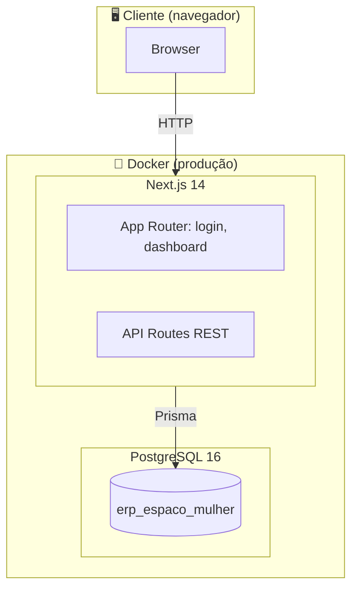
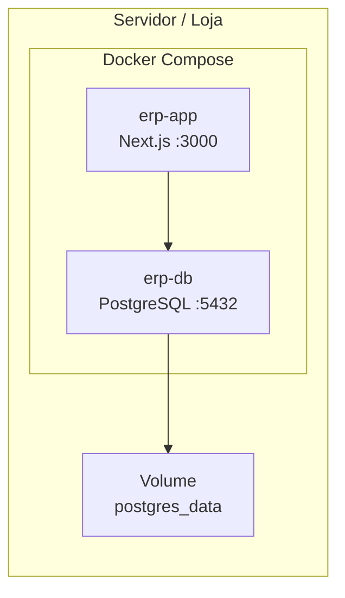
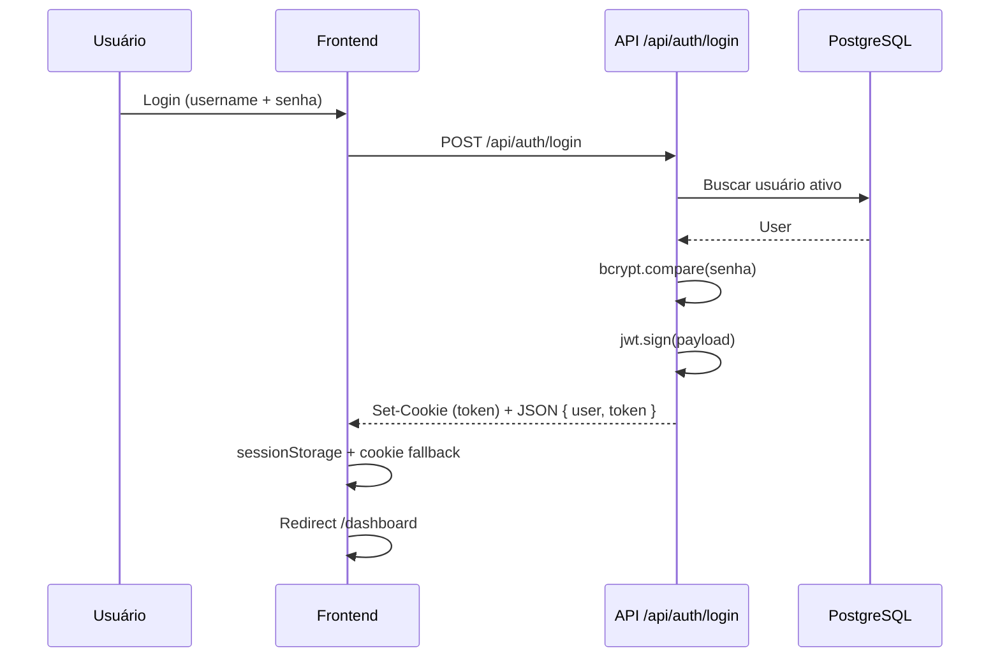
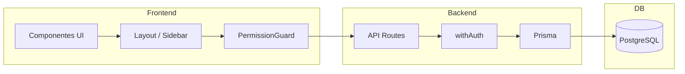
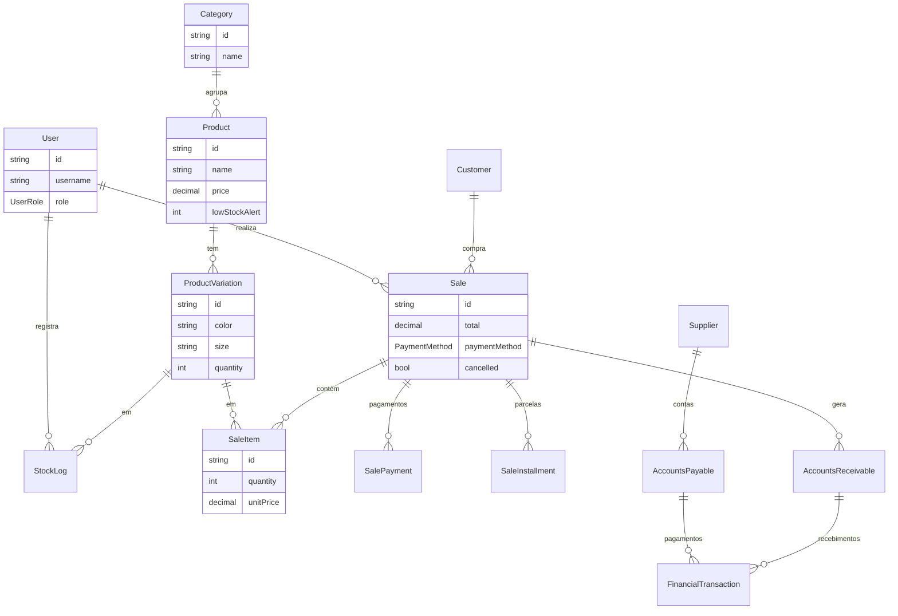

# 🏪 ERP Espaço Mulher

[](https://nextjs.org/)
[](https://www.typescriptlang.org/)
[](https://www.prisma.io/)
[](https://www.postgresql.org/)
[](https://tailwindcss.com/)
[](https://www.docker.com/)

Sistema **ERP full-stack** para loja de varejo de roupas: PDV, estoque por variação (cor/tamanho), gestão financeira, contas a pagar e a receber, relatórios e **controle de usuários por perfil** (Caixa, Gerente, Administrador). Deploy via **Docker** e **em uso em ambiente de loja**.

---

## 📋 Índice

- [Sobre o projeto](#-sobre-o-projeto)
- [Status e ambiente](#-status-e-ambiente)
- [Stack tecnológica](#-stack-tecnológica)
- [Arquitetura](#-arquitetura)
- [Funcionalidades](#-funcionalidades)
- [Controle de usuários e permissões](#-controle-de-usuários-e-permissões)
- [Modelo de dados](#-modelo-de-dados)
- [API REST](#-api-rest)
- [Deploy com Docker](#-deploy-com-docker)
- [Instalação local](#-instalação-local)
- [Scripts](#-scripts)
- [Estrutura do projeto](#-estrutura-do-projeto)
- [Documentação](#-documentação)

---

## 🎯 Sobre o projeto

O **ERP Espaço Mulher** é uma aplicação web completa para gestão de **loja de roupas**: desde o PDV no balcão até o controle financeiro e relatórios. Desenvolvido com **Next.js 14**, **TypeScript**, **Prisma** e **PostgreSQL**, com deploy em **Docker** e **em operação em loja**.

### Destaques

- **PDV (Ponto de Venda)** — Leitor de código de barras, busca por nome/SKU, variações (cor e tamanho), descontos e múltiplas formas de pagamento (dinheiro, PIX, cartão à vista/parcelado, débito, pagamento misto).
- **Estoque por variação** — Controle por produto + cor + tamanho, alertas de estoque baixo, histórico de movimentações e ajustes com auditoria.
- **Gestão financeira** — Vendas, despesas fixas, contas a pagar e a receber, taxas de cartão configuráveis, visão consolidada.
- **Cadastros** — Produtos, categorias, clientes, fornecedores e **usuários com perfis e permissões**.
- **Relatórios** — Vendas diárias, produtos mais vendidos, estoque baixo e análises por período.
- **Notificações** — Alertas de contas a vencer, estoque baixo e cancelamentos de vendas.
- **Controle de acesso** — Três perfis (Caixa, Gerente, Administrador) com permissões hierárquicas e auditoria de ações sensíveis.

---

## 🟢 Status e ambiente

| Item | Descrição |
|------|-----------|
| **Ambiente de produção** | Sistema em uso em loja (operacional). |
| **Deploy** | Docker + Docker Compose (app + PostgreSQL). |
| **Banco de dados** | PostgreSQL 16 (Alpine), dados persistidos em volume Docker. |
| **Aplicação** | Next.js em modo produção, porta configurável (ex.: 3001 no host). |

---

## 🛠 Stack tecnológica

### Frontend

| Tecnologia | Uso |
|------------|-----|
| **Next.js 14** | App Router, SSR, rotas e páginas. |
| **React 18** | Componentes, hooks, interface. |
| **TypeScript** | Tipagem estática em todo o projeto. |
| **Tailwind CSS** | Estilização e layout responsivo. |
| **Lucide React** | Ícones. |
| **Sonner** | Notificações (toasts). |
| **Zod** | Validação de formulários e payloads. |

### Backend

| Tecnologia | Uso |
|------------|-----|
| **Next.js API Routes** | API REST no mesmo projeto (monolito). |
| **Prisma** | ORM, migrations, acesso ao PostgreSQL. |
| **PostgreSQL 16** | Banco de dados principal. |
| **JWT (jsonwebtoken)** | Autenticação (token com userId, username, role). |
| **bcryptjs** | Hash de senhas. |
| **Zod** | Validação de entrada nas rotas. |

### Infraestrutura e ferramentas

| Tecnologia | Uso |
|------------|-----|
| **Docker** | Container da aplicação (build Next.js). |
| **Docker Compose** | Orquestração app + PostgreSQL, volumes, rede, healthcheck. |
| **Vitest** | Testes unitários. |
| **Playwright** | Testes E2E. |
| **ESLint** | Linting. |

---

## 🏗 Arquitetura

### Visão geral



### Stack em produção (Docker)



- **erp-app:** container da aplicação Next.js (build de produção), exposta no host na porta **3001** (mapeamento 3001:3000).
- **erp-db:** container PostgreSQL 16 Alpine, porta **5433** no host (5433:5432), timezone e locale PT-BR, healthcheck antes do app subir.
- **Volumes:** dados do PostgreSQL persistidos em `erp_postgres_data`.

### Fluxo de autenticação



### Camadas da aplicação



---

## ✨ Funcionalidades

| Módulo | Rota | Descrição |
|--------|------|-----------|
| **Dashboard** | `/dashboard` | Resumo, indicadores e atalhos. |
| **PDV** | `/dashboard/pdv` | Ponto de venda, carrinho, múltiplos pagamentos, recibo, código de barras. |
| **Produtos** | `/dashboard/products` | CRUD, variações (cor/tamanho), estoque por variação. |
| **Categorias** | `/dashboard/categories` | Categorias de produtos (restrito a Admin). |
| **Clientes** | `/dashboard/customers` | Cadastro de clientes. |
| **Fornecedores** | `/dashboard/suppliers` | Cadastro de fornecedores. |
| **Vendas** | `/dashboard/sales` | Histórico, recibo, cancelamento com motivo. |
| **Financeiro** | `/dashboard/financial` | Movimentações e visão consolidada. |
| **Contas a pagar** | `/dashboard/accounts-payable` | Contas a pagar e quitação. |
| **Contas a receber** | `/dashboard/accounts-receivable` | Contas a receber e quitação. |
| **Despesas fixas** | `/dashboard/fixed-expenses` | Despesas recorrentes por dia do mês. |
| **Relatórios** | `/dashboard/reports` | Vendas diárias, top produtos, estoque baixo. |
| **Usuários** | `/dashboard/users` | Gestão de usuários e perfis (restrito a Admin/Gerente). |

---

## 🔐 Controle de usuários e permissões

O sistema possui **três perfis** com permissões hierárquicas. O menu lateral e as rotas são filtrados conforme o perfil; a API valida a role em cada endpoint sensível.

### Perfis

| Perfil | Nível | Acesso |
|--------|--------|--------|
| **CAIXA** | 1 | Dashboard, PDV, Produtos (consulta/operação), Clientes, Fornecedores. |
| **GERENTE** | 2 | Tudo do Caixa + Financeiro, Contas a pagar, Contas a receber, Despesas fixas, Relatórios, Vendas (histórico e cancelamento), gestão de Usuários (listar/criar). |
| **ADMIN** | 3 | Acesso total: tudo do Gerente + Categorias, criação/edição/exclusão de Produtos e Usuários, configurações restritas. |

### Implementação

- **Frontend:** `PermissionGuard` e `ROUTE_PERMISSIONS` em `lib/permissions.ts` — cada rota exige uma role mínima; o Sidebar exibe apenas itens permitidos.
- **Backend:** middleware `withAuth` em `lib/middleware.ts` — extrai e valida o JWT (cookie ou header `Authorization: Bearer`); rotas sensíveis fazem checagem explícita de role (ex.: apenas ADMIN para categorias e exclusão de usuários).
- **Auditoria:** ações como desconto em venda, cancelamento e ajuste de estoque registram `userId` em tabelas de log (`DiscountLog`, `CancellationLog`, `StockLog`).

### Autenticação

- **Login:** username + senha; senha validada com bcrypt; JWT com expiração de 7 dias.
- **Armazenamento do token:** cookie httpOnly (recomendado) + fallback em sessionStorage e cookie para compatibilidade (ex.: uso em rede local/Docker).
- **Proteção de rotas:** todas as API Routes (exceto login e health) passam por `withAuth`; frontend redireciona para `/login` em 401.

---

## 📊 Modelo de dados

Principais entidades e relacionamentos:



### Entidades principais

| Modelo | Tabela | Descrição |
|--------|--------|-----------|
| **User** | `users` | Usuários: username, nome, senha (hash), role (CAIXA/GERENTE/ADMIN), ativo. |
| **Category** | `categories` | Categorias de produtos. |
| **Product** | `products` | Produtos: nome, descrição, preço, custo, código de barras, SKU, alerta de estoque. |
| **ProductVariation** | `product_variations` | Variações (cor + tamanho) com quantidade em estoque. |
| **Customer** | `customers` | Clientes. |
| **Sale** | `sales` | Vendas: subtotal, desconto, total, método de pagamento, cancelamento. |
| **SaleItem** | `sale_items` | Itens da venda (produto, variação, quantidade, preço). |
| **SalePayment** | `sale_payments` | Pagamentos por método (pagamento misto), taxas de cartão. |
| **SaleInstallment** | `sale_installments` | Parcelas de vendas a prazo. |
| **StockLog** | `stock_logs` | Movimentações de estoque (tipo, quantidade, motivo, usuário). |
| **FinancialTransaction** | `financial_transactions` | Movimentações financeiras. |
| **AccountsPayable** | `accounts_payable` | Contas a pagar. |
| **AccountsReceivable** | `accounts_receivable` | Contas a receber. |
| **FixedExpense** | `fixed_expenses` | Despesas fixas (dia do mês). |
| **CardFeeConfig** | `card_fee_configs` | Taxas por método e parcelas. |
| **Notification** | `notifications` | Notificações (vencimentos, estoque baixo, cancelamentos). |

---

## 🔌 API REST

As rotas utilizam o middleware **`withAuth`** (token em cookie ou header `Authorization: Bearer`). Respostas em JSON.

### Autenticação

| Método | Rota | Descrição |
|--------|------|-----------|
| POST | `/api/auth/login` | Login (username + senha), retorna token e usuário. |
| POST | `/api/auth/logout` | Limpa cookie de autenticação. |
| GET | `/api/auth/me` | Retorna usuário logado. |

### Recursos principais

| Recurso | Rotas | Observação |
|---------|--------|------------|
| **Produtos** | `GET/POST /api/products`, `GET/PUT/DELETE /api/products/[id]`, `GET/POST/PUT /api/products/[id]/variations`, `GET /api/products/search` | CRUD + variações e busca. |
| **Categorias** | `GET/POST /api/categories`, `PUT/DELETE /api/categories/[id]` | Criação/edição apenas Admin. |
| **Clientes** | `GET/POST /api/customers`, `GET/DELETE /api/customers/[id]` | — |
| **Fornecedores** | `GET/POST /api/suppliers`, `PUT/DELETE /api/suppliers/[id]` | — |
| **Vendas** | `GET/POST /api/sales`, `GET /api/sales/[id]/receipt`, `POST /api/sales/[id]/cancel` | Recibo e cancelamento. |
| **Estoque** | `POST /api/stock/adjust` | Ajuste de estoque (Gerente/Admin). |
| **Usuários** | `GET/POST /api/users`, `PUT/DELETE /api/users/[id]` | Admin/Gerente (restrições por ação). |
| **Financeiro** | `GET/POST /api/financial`, `GET /api/financial/stats` | — |
| **Contas a pagar** | `GET/POST /api/accounts-payable`, `PUT/DELETE /api/accounts-payable/[id]` | — |
| **Contas a receber** | `GET/POST /api/accounts-receivable`, `PUT/DELETE /api/accounts-receivable/[id]` | — |
| **Despesas fixas** | `GET/POST /api/fixed-expenses`, `PUT/DELETE /api/fixed-expenses/[id]` | — |
| **Dashboard** | `GET /api/dashboard/stats` | Estatísticas do dashboard. |
| **Relatórios** | `GET /api/reports/dashboard`, `daily-sales`, `top-products`, `low-stock` | — |
| **Notificações** | `GET/POST /api/notifications`, `GET /api/notifications/check` | — |
| **Health** | `GET /api/health` | Health check (sem auth), verifica conexão com o banco. |

---

## 🐳 Deploy com Docker

O projeto é preparado para **deploy em produção** com Docker. O sistema está **em uso em loja** com essa stack.

### Serviços (docker-compose)

| Serviço | Imagem / Build | Porta no host | Descrição |
|---------|----------------|---------------|-----------|
| **app** | Build local (Dockerfile) | 3001 → 3000 | Aplicação Next.js (produção). |
| **db** | postgres:16-alpine | 5433 → 5432 | PostgreSQL, volume persistente, healthcheck, TZ e locale PT-BR. |

### Comandos

```bash
# Subir a stack (app + banco)
docker compose up -d

# Aplicação: http://localhost:3001
# Banco (host): localhost:5433 (usuário erp, banco erp_espaco_mulher)
```

### Variáveis de ambiente (app)

| Variável | Descrição |
|----------|-----------|
| `DATABASE_URL` | URL do PostgreSQL (no compose: conexão ao serviço `db`). |
| `JWT_SECRET` | Chave para assinatura do JWT (obrigatório em produção). |
| `ADMIN_EMAIL` | Login do usuário admin (criação inicial). |
| `ADMIN_PASSWORD` | Senha do admin (criação inicial). |
| `NODE_ENV` | `production` no compose. |

O primeiro deploy pode rodar migrations e criação do usuário admin via script de inicialização (ex.: `docker-init.js`), conforme configuração do projeto.

Para instruções detalhadas no Windows (Docker Desktop, firewall, persistência), consulte **README_DEPLOY_WINDOWS.md** (se existir no repositório).

---

## 📦 Instalação local

Para desenvolvimento sem Docker:

- **Node.js** 18+
- **PostgreSQL** 14+ (ou 16)
- **npm** ou **yarn**

```bash
git clone https://github.com/lucaaslimadev/ERPespacomulher.git
cd ERPespacomulher

npm install
cp .env.example .env
# Ajuste DATABASE_URL e JWT_SECRET no .env

npm run db:generate
npm run db:migrate
npm run db:seed

npm run dev
```

Acesse: **http://localhost:3000**

Credenciais padrão (após seed): ver `.env.example` ou script de criação de admin (ex.: admin@erp.com / senha definida no seed ou em `ADMIN_PASSWORD`).

---

## 📜 Scripts

| Comando | Descrição |
|--------|-----------|
| `npm run dev` | Servidor de desenvolvimento. |
| `npm run build` | Build de produção. |
| `npm run start` | Servidor de produção (após build). |
| `npm run lint` | ESLint. |
| `npm run db:generate` | Gerar cliente Prisma. |
| `npm run db:migrate` | Executar migrações. |
| `npm run db:studio` | Abrir Prisma Studio. |
| `npm run db:seed` | Popular dados iniciais. |
| `npm run db:create-admin` | Criar usuário admin. |
| `npm run db:create-categories` | Criar categorias padrão. |
| `npm run db:reset-password` | Redefinir senha de usuário. |
| `npm run test` | Testes unitários (Vitest). |
| `npm run test:e2e` | Testes E2E (Playwright). |
| `npm run test:login` | Testar API de login. |
| `npm run test:dashboard` | Testar API do dashboard. |

---

## 📁 Estrutura do projeto

```
ERPespacomulher/
├── app/
│   ├── (auth)/              # Rotas públicas (login)
│   ├── (dashboard)/         # Área autenticada
│   │   └── dashboard/       # PDV, produtos, vendas, financeiro, etc.
│   ├── api/                 # API Routes (REST)
│   │   ├── auth/
│   │   ├── products/
│   │   ├── sales/
│   │   ├── financial/
│   │   ├── reports/
│   │   └── ...
│   ├── layout.tsx
│   ├── page.tsx
│   └── globals.css
├── components/
│   ├── layout/              # DashboardLayout, Sidebar, PermissionGuard
│   └── ui/                  # Button, Card, Input, ConfirmModal, etc.
├── lib/
│   ├── auth.ts              # JWT (verify, sign, requireRole)
│   ├── api.ts               # apiFetch, tratamento 401
│   ├── db.ts                # Prisma client
│   ├── middleware.ts        # withAuth para API
│   ├── permissions.ts       # ROUTE_PERMISSIONS, canAccessPath
│   ├── constants.ts         # AUTH (cookies, storage)
│   └── utils.ts
├── prisma/
│   ├── schema.prisma        # Modelos e enums
│   ├── seed.ts
│   └── migrations/
├── scripts/                 # setup, Docker, criar-admin, reset-password
├── types/
│   └── index.ts             # Tipos compartilhados
├── .env.example
├── Dockerfile
├── docker-compose.yml
├── package.json
├── ARCHITECTURE.md          # Decisões de arquitetura e fluxos
└── README.md
```

---

## 📚 Documentação

- **[ARCHITECTURE.md](./ARCHITECTURE.md)** — Decisões de arquitetura, fluxos, autenticação e deploy.
- **README_DEPLOY_WINDOWS.md** — Deploy no Windows com Docker (quando disponível no repositório).

---

## 📄 Licença

Projeto de uso proprietário.

---

**Desenvolvido com Next.js, TypeScript, Prisma e PostgreSQL · Deploy Docker · Em uso em loja**  
[Repositório no GitHub](https://github.com/lucaaslimadev/ERPespacomulher)
